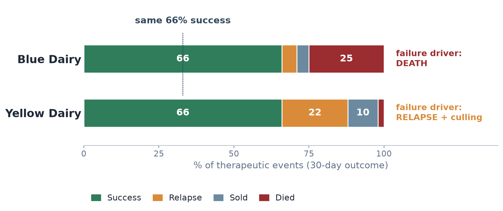
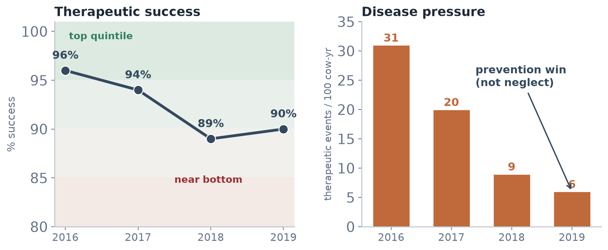

## [2] Picking up where Mike left off

:::::: columns
::: {.column width="46%"}
Mike just showed us:

- Monitoring, metrics, standardization
- That a single number — or a **target** — can mislead
- **Granularity matters** (his 2×2)

> When a measure becomes a target, it ceases to be a good measure.

[— Goodhart / Strathern]{.attrib}
:::

:::: {.column width="54%"}
```{=html}
<svg viewBox="0 0 620 430" xmlns="http://www.w3.org/2000/svg" font-family="Segoe UI, system-ui, sans-serif" style="width:100%;height:auto;">

<!-- quadrant tints -->

<rect x="130" y="40" width="470" height="150" fill="#E4F1EA"/>
<rect x="130" y="190" width="470" height="150" fill="#F6E2E1"/>
<!-- grid -->
<rect x="130" y="40" width="470" height="300" fill="none" stroke="#B9C4CF" stroke-width="1.5"/>
<line x1="365" y1="40" x2="365" y2="340" stroke="#B9C4CF" stroke-width="1.5"/>
<line x1="130" y1="190" x2="600" y2="190" stroke="#B9C4CF" stroke-width="1.5"/>
<!-- cell labels -->
<text x="247" y="105" text-anchor="middle" font-size="15" font-weight="700" fill="#1F4A34">Little
disease</text>
<text x="483" y="98"  text-anchor="middle" font-size="15" font-weight="700" fill="#1F4A34">Judicious
use</text>
<text x="483" y="120" text-anchor="middle" font-size="12.5" fill="#37624B">real
disease + prevention</text>
<text x="247" y="258" text-anchor="middle" font-size="15" font-weight="700" fill="#8A2D30">Poor
detection</text>
<text x="247" y="280" text-anchor="middle" font-size="12.5" fill="#8A2D30">welfare
risk</text>
<text x="483" y="268" text-anchor="middle" font-size="15" font-weight="700" fill="#8A2D30">Indiscriminate
use</text> <!-- axes labels -->
<text x="365" y="372" text-anchor="middle" font-size="13.5" font-weight="700" fill="#34495E">Antimicrobial
use →</text>
<text x="247" y="392" text-anchor="middle" font-size="11.5" fill="#64748B">low</text>
<text x="483" y="392" text-anchor="middle" font-size="11.5" fill="#64748B">high</text>
<text x="40" y="190" text-anchor="middle" font-size="13.5" font-weight="700" fill="#34495E" transform="rotate(-90 40 190)">Stewardship</text>
<text x="118" y="60"  text-anchor="end" font-size="11.5" fill="#64748B">present</text>
<text x="118" y="335" text-anchor="end" font-size="11.5" fill="#64748B">absent</text>

</svg>
```

::: {.tiny style="text-align:center;"}
Same *use* level splits into good **and** bad — you can't tell which
without context.
:::
::::
::::::

::: notes
This is the hand-off from Mike. His 2×2 proves low use isn't
automatically good and high use isn't automatically bad. Hold that
thought — the rest of the talk is about the measurement that tells these
quadrants apart: disease context and therapeutic outcome.
:::

------------------------------------------------------------------------

## [3] Step 1 — to measure use, we needed disease context

Regimens became our favored AMU metric — a **well-defined relationship
to disease and to reality** (dose × duration × indication).

::: {style="text-align:center; font-size:1.15em; margin:0.4em 0 0.2em; color:#34495E;"}
Total Regimens =  [Disease
Incidence]{style="color:#C0693B;font-weight:700;"} × [Regimens per
case]{style="color:#C0693B;font-weight:700;"}
:::

::: small
- **The importance of capturing disease data** — you can't read use
  without it
- What changes when disease incidence goes from *diagnosed* →
  *anticipated*?
:::

[Building on M. Apley's regimen decomposition · Schrag et al., dairy AMU
quantification, Part 1 (2020)]{.attrib}

::: notes
Regimens tie to what actually happens to an animal, unlike
defined-constant or weight-based metrics. The decomposition is Mike's —
I'm taking his third term (regimens per disease event) and, next, adding
what the regimen achieved.
:::

------------------------------------------------------------------------

## [4] Step 2 — but the real question is

::: {.lead-stmt style="font-size:2.0em; margin-top:0.8em;"}
Did the drug work?
:::

<br>

::: {.small .muted}
Measuring use was the *means*. The **therapeutic outcome** is the end —
and the only thing that tells us whether a treatment earned its place.
:::

::: notes
This is the pivot of the talk. Everything before was infrastructure. The
question a caretaker actually asks is binary and human: did this animal
get better?
:::

------------------------------------------------------------------------

## [5] How we define an outcome

```{=html}
<svg viewBox="0 0 1080 300" xmlns="http://www.w3.org/2000/svg" font-family="Segoe UI, system-ui, sans-serif" style="width:100%;height:auto;">

<defs>
<marker id="ar6" markerWidth="9" markerHeight="9" refX="7" refY="3" orient="auto" markerUnits="userSpaceOnUse">
<path d="M0,0 L7,3 L0,6 Z" fill="#C0693B"/> </marker> </defs>
<g stroke="#C0693B" stroke-width="2.5" marker-end="url(#ar6)">
<line x1="286" y1="150" x2="330" y2="150"/>
<line x1="592" y1="150" x2="636" y2="150"/> </g> <!-- box 1 -->
<rect x="24" y="95" width="260" height="110" rx="10" fill="#FFFFFF" stroke="#34495E" stroke-width="1.5"/>
<text x="154" y="140" text-anchor="middle" font-size="17" font-weight="800" fill="#34495E">1
Therapeutic Event</text>
<text x="154" y="168" text-anchor="middle" font-size="13.5" fill="#64748B">regimens
≤ 7 days apart</text> <!-- box 2 -->
<rect x="336" y="95" width="254" height="110" rx="10" fill="#FFFFFF" stroke="#34495E" stroke-width="1.5"/>
<text x="463" y="140" text-anchor="middle" font-size="17" font-weight="800" fill="#34495E">30-day
window</text>
<text x="463" y="168" text-anchor="middle" font-size="13.5" fill="#64748B">outcome
evaluated</text> <!-- outcome chips -->
<g font-family="Segoe UI, system-ui, sans-serif">
<rect x="648" y="40"  width="408" height="48" rx="8" fill="#2F7D5B"/>
<text x="668" y="70" font-size="16" font-weight="700" fill="#fff">Success</text>
<text x="812" y="70" font-size="12.5" fill="#E6F0EB">stayed in herd · no
further TE</text>
<rect x="648" y="96"  width="408" height="48" rx="8" fill="#D98B3A"/>
<text x="668" y="126" font-size="16" font-weight="700" fill="#fff">Relapse</text>
<text x="812" y="126" font-size="12.5" fill="#FBEEE0">another TE within
30 days</text>
<rect x="648" y="152" width="408" height="48" rx="8" fill="#6B8AA0"/>
<text x="668" y="182" font-size="16" font-weight="700" fill="#fff">Sold</text>
<text x="812" y="182" font-size="12.5" fill="#EAF0F4">culled within 30
days</text>
<rect x="648" y="208" width="408" height="48" rx="8" fill="#9B2D30"/>
<text x="668" y="238" font-size="16" font-weight="700" fill="#fff">Died</text>
<text x="812" y="238" font-size="12.5" fill="#F3DEDF">death within 30
days</text> </g>

</svg>
```

::: {.tiny style="text-align:center;"}
This is exactly what the **ICASA_Disease** app computes — you set the
7-day and 30-day windows yourself. · Schrag et al. 2022
:::

::: notes
Four mutually exclusive states over a fixed window. The two window
lengths are choices, and the app exposes them so you can test
sensitivity. Keep "relapse" and "died" in mind — they're about to behave
very differently.
:::

------------------------------------------------------------------------

## [6] We're not alone — this is where the science is going

::::::: columns
:::: {.column width="50%"}
**Human medicine**

microbiological cure → composite endpoint → **DOOR**

::: {.small .muted}
One ordinal rank for the *whole* clinical course — best = **alive, no
complications**; worst = **death** — combining efficacy **and** harms.
*"Moving beyond mortality."*
:::
::::

:::: {.column width="50%"}
**Cattle**

clinical & bacteriological cure · FTS · case-fatality · relapse ·
chronic

::: {.small .muted}
mastitis review *"What is success?"* — bacteriological cure ranges
**27–95%** across studies and doesn't predict clinical outcome.
:::
::::
:::::::

::: {style="background:#E4F1EA;border-left:4px solid #2F7D5B;border-radius:8px;padding:0.5em 0.8em;margin-top:0.6em;"}
Both fields converged on the same answer: **multi-dimensional,
whole-course outcomes** — because a single endpoint distorts.
:::

[DOOR endpoint — *"Moving Beyond Mortality,"* Clin Infect Dis 2024;
first proposed by Evans et al. 2015. Mastitis review 2021.]{.attrib}

::: notes
Credibility slide for the skeptics (Ivanek, Apley). We're not
improvising — human infectious-disease trials reached the same
conclusion. DOOR was first proposed by Evans et al. 2015 (CID; a 2023
correction fixed one confidence interval, not the concept). The version
I lean on is the 2024 "Moving Beyond Mortality" paper (CID; free on
PMC10874265), which builds a 5-tier rank — alive/no-events down to death
— and applies it to two real pneumonia trials (ZEPHyR, VITAL). Our
within-farm Success/Relapse/ Sold/Died profile is the production analog.
:::

------------------------------------------------------------------------

## [7] Where DOOR came from {data-menu-title="Paper 1 — Evans 2015"}

[Paper 1 · Evans et al. 2015]{.kicker}

:::::::: columns
::::: {.column width="49%"}
**The problem they named**

::: small
- Competing risks **distort** use metrics — days-of-therapy falls if the
  patient dies
- Benefits and harms analyzed **separately**, so no patient is ever seen
  whole
- Non-inferiority designs reward **blurring** the difference
:::

**The fix: rank the whole course**

::: small
- **DOOR** — every participant gets one ordinal rank for their entire
  clinical experience
- **RADAR** — DOOR for use strategies: rank on outcome first, then break
  ties by *shorter* antibiotic duration
:::
:::::

:::: {.column width="51%"}
```{=html}
<svg viewBox="0 0 600 276" xmlns="http://www.w3.org/2000/svg" font-family="Segoe UI, system-ui, sans-serif" style="width:100%;height:auto;">

<g> <rect x="20" y="10"  width="560" height="46" rx="8" fill="#2F7D5B"/>
<circle cx="48" cy="33" r="13" fill="#FFFFFF" fill-opacity="0.25"/>
<text x="48" y="38" text-anchor="middle" font-size="14" font-weight="800" fill="#FFFFFF">1</text>
<text x="76" y="38" font-size="14.5" font-weight="700" fill="#FFFFFF">Clinical
benefit, no adverse effects</text>

<rect x="20" y="62" width="560" height="46" rx="8" fill="#7DA98F"/>
<circle cx="48" cy="85" r="13" fill="#FFFFFF" fill-opacity="0.3"/>
<text x="48" y="90" text-anchor="middle" font-size="14" font-weight="800" fill="#123322">2</text>
<text x="76" y="90" font-size="14.5" font-weight="700" fill="#123322">Clinical
benefit, some AEs</text>

<rect x="20" y="114" width="560" height="46" rx="8" fill="#B9C4CF"/>
<circle cx="48" cy="137" r="13" fill="#FFFFFF" fill-opacity="0.45"/>
<text x="48" y="142" text-anchor="middle" font-size="14" font-weight="800" fill="#34495E">3</text>
<text x="76" y="142" font-size="14.5" font-weight="700" fill="#34495E">Survival,
no benefit, no AEs</text>

<rect x="20" y="166" width="560" height="46" rx="8" fill="#C97F52"/>
<circle cx="48" cy="189" r="13" fill="#FFFFFF" fill-opacity="0.25"/>
<text x="48" y="194" text-anchor="middle" font-size="14" font-weight="800" fill="#FFFFFF">4</text>
<text x="76" y="194" font-size="14.5" font-weight="700" fill="#FFFFFF">Survival,
no benefit, with AEs</text>

<rect x="20" y="218" width="560" height="46" rx="8" fill="#9B2D30"/>
<circle cx="48" cy="241" r="13" fill="#FFFFFF" fill-opacity="0.25"/>
<text x="48" y="246" text-anchor="middle" font-size="14" font-weight="800" fill="#FFFFFF">5</text>
<text x="76" y="246" font-size="14.5" font-weight="700" fill="#FFFFFF">Death</text>
</g>

</svg>
```

::: {.tiny style="text-align:center;"}
Their generic 5-level overall clinical outcome — mutually exclusive,
ordered by desirability.
:::
::::
::::::::

::: {style="background:#F7E7DD;border-left:4px solid #C0693B;border-radius:8px;padding:0.45em 0.8em;margin-top:0.4em;font-size:0.72em;color:#7A3E1E;"}
**For us:** *"Outcomes are used to analyze patients, rather than using
patients to analyze outcomes."* Success / Relapse / Sold / Died is the
same move — one ordered verdict per animal.
:::

[Evans SR, Rubin D, Follmann D, et al. *Clin Infect Dis*
2015;61(5):800–6]{.attrib}

::: notes
Paper 1 is the origin. The framing gift here is the competing-risks
critique: days-of-therapy looks *better* when the patient dies. That is
exactly why a use metric alone can't be the scoreboard — and it's an
argument from human medicine, not from me.

RADAR's tie-break rule is the one to say out loud: clinical outcome
trumps duration of use. A patient with a worse outcome can never
out-rank a patient with a better one, no matter how little antibiotic
they got. That is Mike's line in statistical form — less use is better,
but never at the expense of the patient.

The pull-quote is the philosophical heart, and it's how I'd defend our
four-category outcome to a statistician: we're not tracking four
endpoints, we're issuing one verdict per animal.
:::

------------------------------------------------------------------------

## [8] The correction — and why I like it {data-menu-title="Paper 2 — Correction"}

[Paper 2 · the erratum, 2023]{.kicker}

::: {.small style="margin-bottom:0.2em;"}
The 2015 illustration reported a DOOR probability of **64.8%** — the
chance a random patient does better on the new strategy. Seven years
later the authors corrected **the confidence interval, not the number**:
the method was never specified, and the interval was too narrow.
:::

```{=html}
<svg viewBox="0 0 620 250" xmlns="http://www.w3.org/2000/svg" font-family="Segoe UI, system-ui, sans-serif" style="width:88%;height:auto;display:block;margin:0 auto;">

<line x1="310" y1="56" x2="310" y2="200" stroke="#94A3B8" stroke-width="1.5" stroke-dasharray="5 4"/>
<text x="310" y="46" text-anchor="middle" font-size="11.5" fill="#64748B">50%
= no difference</text>

<text x="60" y="82" font-size="13.5" font-weight="700" fill="#9B2D30">as
published (2015) — 57% to 71%</text>
<line x1="345" y1="99" x2="415" y2="99" stroke="#9B2D30" stroke-width="7" stroke-linecap="round"/>
<circle cx="384" cy="99" r="7" fill="#FFFFFF" stroke="#9B2D30" stroke-width="3"/>

<text x="60" y="147" font-size="13.5" font-weight="700" fill="#2F7D5B">corrected
(2023) — 43% to 82%</text>
<line x1="275" y1="164" x2="470" y2="164" stroke="#2F7D5B" stroke-width="7" stroke-linecap="round"/>
<circle cx="384" cy="164" r="7" fill="#FFFFFF" stroke="#2F7D5B" stroke-width="3"/>
<text x="384" y="190" text-anchor="middle" font-size="11.5" fill="#2F7D5B">64.8%</text>

<line x1="60" y1="200" x2="560" y2="200" stroke="#34495E" stroke-width="2"/>
<g font-size="11" fill="#64748B" text-anchor="middle">
<line x1="60"  y1="200" x2="60"  y2="206" stroke="#34495E"/><text x="60"  y="222">0%</text>
<line x1="185" y1="200" x2="185" y2="206" stroke="#34495E"/><text x="185" y="222">25%</text>
<line x1="310" y1="200" x2="310" y2="206" stroke="#34495E"/><text x="310" y="222">50%</text>
<line x1="435" y1="200" x2="435" y2="206" stroke="#34495E"/><text x="435" y="222">75%</text>
<line x1="560" y1="200" x2="560" y2="206" stroke="#34495E"/><text x="560" y="222">100%</text>
</g>

</svg>
```

::: {style="background:#F7E7DD;border-left:4px solid #C0693B;border-radius:8px;padding:0.45em 0.8em;margin-top:0.3em;font-size:0.72em;color:#7A3E1E;"}
**For us:** the corrected interval **crosses 50%** — with 26 patients,
the honest answer was *"we can't tell yet."* Small denominators earn
wide intervals. One more reason to read the **trend**, not the point
estimate.
:::

[Correction to Evans et al. *Clin Infect Dis* 2023;76(1):182 — interval
re-estimated by the method of Halperin et al.]{.attrib}

::: notes
This is a one-page erratum and I include it deliberately — it's the most
useful slide in the set for how we should behave.

What changed: the point estimate, 64.8%, stands. The 95% interval went
from 57–71% to 43–82%, because the original never specified how it was
estimated. The corrected interval crosses 50, which means the
illustration never demonstrated a difference at all.

Two takeaways for this room. First, this is science working — the
authors published a correction on their own method. Second, and this is
the one that matters for us: rank-based outcome measures on small
numbers produce wide intervals. Our farm-level denominators are small.
When we look at one quarter's success rate on one farm, we are in
exactly this territory. That's the statistical argument for trending
over targeting — and it's why the next slides are about direction, not
thresholds.
:::

------------------------------------------------------------------------

## [9] DOOR in the wild — two pneumonia trials {data-menu-title="Paper 3 — Moving Beyond Mortality"}

[Paper 3 · Howard-Anderson et al. 2024]{.kicker}

::: {.small style="margin-bottom:0.3em;"}
A multidisciplinary task force — clinicians, FDA, NIH, industry, **and
patient advocates** — built a pneumonia DOOR (rank 1 = *alive, no
events*; ranks 2–4 = alive with 1, 2, 3 events; rank 5 = *death*), then
re-analyzed two completed RCTs.
:::

```{=html}
<div style="display:flex;gap:0.8em;justify-content:center;margin-top:0.2em;">
  <div style="flex:1;background:#F1F5F9;border-radius:10px;padding:0.6em 0.8em;">
    <div style="font-weight:800;color:#34495E;">ZEPHyR &nbsp;<span style="font-weight:400;color:#64748B;font-size:0.8em;">n = 448</span></div>
    <div style="color:#64748B;font-size:0.72em;margin:0.15em 0 0.4em;">vancomycin vs linezolid · MRSA pneumonia</div>
    <div style="font-size:0.85em;color:#34495E;">DOOR probability <b>50.2%</b> <span style="color:#64748B;font-size:0.8em;">(45.1–55.3)</span></div>
  </div>
  <div style="flex:1;background:#F1F5F9;border-radius:10px;padding:0.6em 0.8em;">
    <div style="font-weight:800;color:#34495E;">VITAL &nbsp;<span style="font-weight:400;color:#64748B;font-size:0.8em;">n = 718</span></div>
    <div style="color:#64748B;font-size:0.72em;margin:0.15em 0 0.4em;">linezolid vs tedizolid · ventilated pneumonia</div>
    <div style="font-size:0.85em;color:#34495E;">DOOR probability <b>48.7%</b> <span style="color:#64748B;font-size:0.8em;">(44.8–52.6)</span></div>
  </div>
</div>
```

::: {style="background:#E4F1EA;border-left:4px solid #2F7D5B;border-radius:8px;padding:0.5em 0.8em;margin-top:0.5em;font-size:0.75em;"}
Both headlines say **"no difference."** Decompose VITAL and the drugs
are **not** the same: tedizolid did **worse on clinical response**
(46.3%) and **better on adverse events** (52.3%). The two moved in
opposite directions and cancelled — into one flat number.
:::

[Howard-Anderson J, et al. *Moving Beyond Mortality.* Clin Infect Dis
2024;78(2):259–68]{.attrib}

::: notes
Paper 3 is the one that earns its place, because it does our argument
for us — in human medicine, in a registrational trial, in CID.

Setup first: FDA guidance allows 14- or 28-day all-cause mortality as
the primary endpoint for these trials. FNIH and CTTI both said mortality
alone is too blunt. So this group built the rank — alive with no events
at the top, death at the bottom, graded by how many bad things happened
along the way — and applied it retrospectively to ZEPHyR and VITAL.

Now the punchline, and I want to say it slowly. Both trials came back
with a DOOR probability of about 50 — no difference. If you stopped
there, you'd call the drugs interchangeable. Break VITAL into its
components and tedizolid is *worse* on clinical response and *better* on
safety. Two real, opposite signals, averaging into a number that says
nothing happened.

That is precisely my next slide, in people instead of cattle. Their
composite hid a real difference; our 66% success hides whether a farm is
losing animals or re-treating them. Same failure, same fix: decompose.

And ZEPHyR runs the same trick in reverse — worth having ready if the
room engages. The original trial concluded linezolid was *superior* to
vancomycin for MRSA pneumonia. Under DOOR, that advantage disappears:
the efficacy gain was offset by non-significant increases in infectious
complications, SAEs, and death. The authors say plainly it could change
prescribing. So the whole-course view doesn't just find differences a
single number hides — it also **dissolves differences a single number
manufactures.** Both directions, same lesson: the number you choose
decides the answer you get.

Weighting comes next slide.
:::

------------------------------------------------------------------------

## [10] Who decides how bad "bad" is? {data-menu-title="Discussion — partial credit"}

[Discussion · from Paper 3]{.kicker}

::: {.small style="margin-bottom:0.1em;"}
DOOR's **partial credit** analysis scores the ranks like a test: best =
**100**, death = **0**, and the middle ranks are worth *whatever you
think they're worth* — as long as the order holds. Two people can score
the same trial differently and **both be right**.
:::

```{=html}
<svg viewBox="0 0 720 280" xmlns="http://www.w3.org/2000/svg" font-family="Segoe UI, system-ui, sans-serif" style="width:100%;height:auto;">

<text x="300" y="26" text-anchor="middle" font-size="13" font-weight="700" fill="#34495E">Patient
A</text>
<text x="300" y="43" text-anchor="middle" font-size="11" fill="#64748B">“one
setback isn't so bad”</text>
<text x="480" y="26" text-anchor="middle" font-size="13" font-weight="700" fill="#34495E">Patient
B</text>
<text x="480" y="43" text-anchor="middle" font-size="11" fill="#64748B">“any
setback is severe”</text>
<text x="640" y="26" text-anchor="middle" font-size="11.5" font-weight="700" fill="#C0693B">set
by</text>
<text x="640" y="43" text-anchor="middle" font-size="11.5" font-weight="700" fill="#C0693B">values</text>

<g font-size="13.5">
<rect x="16" y="58"  width="230" height="38" rx="7" fill="#2F7D5B"/>
<text x="30" y="83" font-size="13" font-weight="700" fill="#FFFFFF">1 ·
alive, no events</text>
<text x="300" y="84" text-anchor="middle" font-size="15" font-weight="800" fill="#2F7D5B">100</text>
<text x="480" y="84" text-anchor="middle" font-size="15" font-weight="800" fill="#2F7D5B">100</text>
<text x="640" y="84" text-anchor="middle" font-size="10.5" fill="#94A3B8">fixed</text>

<rect x="16" y="102" width="230" height="38" rx="7" fill="#7DA98F"/>
<text x="30" y="127" font-size="13" font-weight="700" fill="#123322">2 ·
alive, 1 event</text>
<text x="300" y="128" text-anchor="middle" font-size="15" font-weight="800" fill="#C0693B">90</text>
<text x="480" y="128" text-anchor="middle" font-size="15" font-weight="800" fill="#C0693B">30</text>
<text x="640" y="128" text-anchor="middle" font-size="10.5" fill="#C0693B">yours</text>

<rect x="16" y="146" width="230" height="38" rx="7" fill="#B9C4CF"/>
<text x="30" y="171" font-size="13" font-weight="700" fill="#34495E">3 ·
alive, 2 events</text>
<text x="300" y="172" text-anchor="middle" font-size="15" font-weight="800" fill="#C0693B">70</text>
<text x="480" y="172" text-anchor="middle" font-size="15" font-weight="800" fill="#C0693B">20</text>
<text x="640" y="172" text-anchor="middle" font-size="10.5" fill="#C0693B">yours</text>

<rect x="16" y="190" width="230" height="38" rx="7" fill="#C97F52"/>
<text x="30" y="215" font-size="13" font-weight="700" fill="#FFFFFF">4 ·
alive, 3 events</text>
<text x="300" y="216" text-anchor="middle" font-size="15" font-weight="800" fill="#C0693B">40</text>
<text x="480" y="216" text-anchor="middle" font-size="15" font-weight="800" fill="#C0693B">10</text>
<text x="640" y="216" text-anchor="middle" font-size="10.5" fill="#C0693B">yours</text>

<rect x="16" y="234" width="230" height="38" rx="7" fill="#9B2D30"/>
<text x="30" y="259" font-size="13" font-weight="700" fill="#FFFFFF">5 ·
death</text>
<text x="300" y="260" text-anchor="middle" font-size="15" font-weight="800" fill="#9B2D30">0</text>
<text x="480" y="260" text-anchor="middle" font-size="15" font-weight="800" fill="#9B2D30">0</text>
<text x="640" y="260" text-anchor="middle" font-size="10.5" fill="#94A3B8">fixed</text>
</g>

</svg>
```

::: {style="background:#F7E7DD;border-left:4px solid #C0693B;border-radius:8px;padding:0.45em 0.8em;margin-top:0.35em;font-size:0.72em;color:#7A3E1E;"}
**Discussion for this room:** on *your* operation — is one relapse a 90
or a 30? Is a sale at day 20 nearer success or nearer death? The
statistics can't answer that. **You do.**
:::

[Partial credit analysis — Howard-Anderson et al. 2024. Illustrative
scores.]{.attrib}

::: notes
This is a discussion slide — I'd rather ask it than answer it.

The mechanic: score the ranks like a test. Alive with no events is 100,
death is 0, and everything in between is worth whatever the person
grading thinks it's worth, as long as you don't invert the order. The
authors' point is that this is a *values* question wearing a
statistician's coat. Whether one complication is a minor detour or a
disaster depends on who you ask — so let them say.

Note the scores on this slide are mine, for illustration; the paper used
three hypothetical keys and found no difference between arms under any
of them. In a real prospective trial you'd have to prespecify the key,
or you're just picking the answer you like.

Why this matters for us: it's the honest reason we do **not** collapse
Success / Relapse / Sold / Died into one index. The moment you do, you
have silently imposed your weighting on every producer who reads it. A
cow-calf operation and a commercial yard genuinely should not weigh a
sale the same way. Show the profile, let them bring the values.

If the room wants to argue about this — good. That's the argument worth
having, and it's the one that decides whether a number is trusted or
ignored.
:::

------------------------------------------------------------------------

## [11] The core insight: a single number lies

{width="86%"}

::: small
Same **66% success** — opposite stories. **Death** is unambiguously bad;
**relapse/aggressive retreatment** is ambiguous and warrants a look.
:::

::: notes
This is the heart of the talk. Two farms, identical headline success.
One is losing animals; the other is re-treating and culling. The single
number would call them equal. Decompose it and the action is completely
different.
:::

------------------------------------------------------------------------

## [12] The retreatment nuance is real science

::::: columns
::: {.column width="52%"}
**Post-Treatment Interval (PTI)**

- Make animals eligible to re-treat at **3 days** → retreatment rates
  jump
- The "failure" is partly an **artifact of measuring too soon**
- Retreatment drug-*switching* is linked to **more resistant** isolates
:::

::: {.column width="48%"}
```{=html}
<svg viewBox="0 0 480 260" xmlns="http://www.w3.org/2000/svg" font-family="Segoe UI, system-ui, sans-serif" style="width:100%;height:auto;">

<line x1="40" y1="150" x2="450" y2="150" stroke="#34495E" stroke-width="2"/>
<circle cx="60" cy="150" r="7" fill="#2F7D5B"/>
<text x="60" y="182" text-anchor="middle" font-size="12.5" fill="#34495E">treat</text>
<text x="60" y="197" text-anchor="middle" font-size="10.5" fill="#64748B">day
0</text> <!-- recovery window -->
<rect x="60" y="118" width="150" height="32" fill="#DCEAE2"/>
<text x="135" y="110" text-anchor="middle" font-size="11.5" fill="#2F7D5B">expected
recovery</text> <!-- day 3 eligible -->
<line x1="120" y1="132" x2="120" y2="168" stroke="#9B2D30" stroke-width="2" stroke-dasharray="4 3"/>
<text x="120" y="222" text-anchor="middle" font-size="11.5" font-weight="700" fill="#9B2D30">re-treat
\@ day 3</text>
<text x="120" y="238" text-anchor="middle" font-size="10.5" fill="#9B2D30">=
manufactured "failure"</text> <!-- day 9 eligible -->
<line x1="300" y1="132" x2="300" y2="168" stroke="#2F7D5B" stroke-width="2"/>
<text x="300" y="222" text-anchor="middle" font-size="11.5" font-weight="700" fill="#2F7D5B">re-treat
\@ day 9</text>
<text x="300" y="238" text-anchor="middle" font-size="10.5" fill="#2F7D5B">true
failure</text>

</svg>
```
:::
:::::

::: {style="text-align:center;font-weight:700;color:#34495E;margin-top:0.3em;"}
So: investigate the <em>trend</em> — don't just read the number.
:::

::: notes
Pre-empts the obvious critique of the retreatment example. Retreatment
behavior is sensitive to the eligibility window; a rising relapse rate
can mean a shortened effective PTI or a protocol change, not drug
failure. And switching drugs on relapse is tied to resistance — a first
thread toward Bruce.
:::

------------------------------------------------------------------------

## [13] They named our problem in 2015 {data-menu-title="Discussion — clinician decision"}

[Discussion · from Paper 1]{.kicker}

> Patients may switch therapy because of clinical failure but should not
> necessarily be considered a clinical failure **because they switch
> therapy.**

[— Evans et al. 2015, on constructing an overall clinical
outcome]{.attrib style="margin-bottom:0.5em;"}

::::::: columns
:::: {.column width="52%"}
::: small
**Their warning**

- Some endpoints are partly a **clinician decision**, not purely a
  patient outcome
- That adds a **second source of variation** — the person, not the
  disease
- Their fix: prefer outcomes that are *"a function of the patient,"* or
  **standardize the decision criteria**
:::
::::

:::: {.column width="48%"}
::: small
**Our version, word for word**

- **Relapse** is a retreatment — and a retreatment is a *person*
  deciding
- Change the eligibility window and the "failure" rate moves, with no
  animal changing at all
- So: **fix the window** (that's the 7 / 30-day setting), then read the
  trend
:::
::::
:::::::

::: {style="background:#F7E7DD;border-left:4px solid #C0693B;border-radius:8px;padding:0.45em 0.8em;margin-top:0.3em;font-size:0.72em;color:#7A3E1E;"}
Human-medicine statisticians wrote down our PTI problem eleven years
ago. **Relapse measures the protocol as much as the animal** — which is
exactly why it's the category to *investigate*, not to police.
:::

::: notes
This is the slide I'd put money on for generating discussion, because it
tells the room that our messiest category was a known problem in human
trials before we ever built the app.

Read the quote slowly — it rewards it. A patient switching therapy is
evidence of failure, but it is not the same thing as failure, because a
human being made that call. The moment your endpoint contains a
clinician decision, you are measuring the clinician as well as the
patient.

That is our relapse category exactly. When I said earlier that a 3-day
post-treatment interval manufactures failures, this is the formal
version: shorten the window and the retreatment rate climbs while not
one animal's biology has changed. We are partly measuring protocol.

Their prescription is the one we followed without knowing it —
standardize the decision criteria. That's what the 7-day and 30-day
windows are. Fix them, publish them, hold them constant, and *then* the
trend means something.

The honest concession, if pushed: this doesn't eliminate the clinician,
it just holds them still. Which is why relapse is the flag that starts a
conversation, never the number that ends one.
:::

------------------------------------------------------------------------

## [14] Context changed the answer {data-menu-title="Discussion — subgroups"}

[Discussion · from Paper 3]{.kicker}

::: {.small style="margin-bottom:0.3em;"}
Same VITAL trial, same two drugs, sliced by **kidney function** — and
the recommendation flips depending on the patient in front of you.
:::

```{=html}
<div style="display:flex;flex-direction:column;gap:0.4em;margin:0.2em 0 0.3em;">
  <div style="display:flex;align-items:center;background:#F1F5F9;border-radius:9px;padding:0.5em 0.9em;">
    <div style="flex:1;font-weight:700;color:#34495E;font-size:0.8em;">Best kidney function <span style="font-weight:400;color:#64748B;">(CrCl &#8805; 90)</span></div>
    <div style="font-size:0.8em;font-weight:800;color:#2F7D5B;">&#8592; favors linezolid</div>
  </div>
  <div style="display:flex;align-items:center;background:#F1F5F9;border-radius:9px;padding:0.5em 0.9em;">
    <div style="flex:1;font-weight:700;color:#34495E;font-size:0.8em;">Moderately reduced <span style="font-weight:400;color:#64748B;">(CrCl &lt; 60)</span></div>
    <div style="font-size:0.8em;font-weight:800;color:#C0693B;">trend &#8594; tedizolid</div>
  </div>
  <div style="display:flex;align-items:center;background:#F1F5F9;border-radius:9px;padding:0.5em 0.9em;">
    <div style="flex:1;font-weight:700;color:#34495E;font-size:0.8em;">Worst kidney function <span style="font-weight:400;color:#64748B;">(CrCl &lt; 15)</span></div>
    <div style="font-size:0.8em;font-weight:800;color:#C0693B;">&#8594; favors tedizolid</div>
  </div>
</div>
```

::::::: columns
:::: {.column width="50%"}
::: {style="background:#F6E2E1;border-left:4px solid #9B2D30;border-radius:8px;padding:0.45em 0.8em;font-size:0.68em;color:#8A2D30;"}
**And they said so themselves:** few patients, many subgroups — *"should
be interpreted with caution, viewed as hypothesis generating."*
:::
::::

:::: {.column width="50%"}
::: {style="background:#E4F1EA;border-left:4px solid #2F7D5B;border-radius:8px;padding:0.45em 0.8em;font-size:0.68em;color:#1F4A34;"}
**That caution *is* the discipline.** Context tells you which question
to ask. It never hands you a target.
:::
::::
:::::::

[Subgroup analysis — Howard-Anderson et al. 2024, Figure 4 (intervals
there)]{.attrib}

::: notes
Setup for the next slide, and a fair-minded one.

The finding: split VITAL by renal function and the drugs trade places.
Good kidney function, linezolid looks better. Kidney disease, tedizolid
looks better — consistent with what's already known about linezolid and
thrombocytopenia in renal impairment, which is why the authors take it
at all seriously.

Now the part I want to model for this room, because it's the posture I'm
asking everyone to adopt. The authors immediately flagged their own
finding: small numbers, lots of subgroups, treat it as **hypothesis
generating**. They did not turn it into a rule. I'm quoting directions,
not point estimates, on purpose — the intervals are in their Figure 4
and they are wide.

That restraint is the whole argument. Context doesn't deliver a target;
it tells you which question is worth asking. A subgroup finding says
"look here," not "do this." Which is exactly what I'm about to ask you
to do with a farm's success trend — let it raise *"why is…?"*, not
*"above or below the line."*
:::

------------------------------------------------------------------------

## [15] Why trends, within farm context, are the only path to action

{width="88%"}

::: small
Red Dairy metritis: success **96% → 89%** looks tiny — but it moved from
the **top quintile to near the bottom**, while disease pressure
**collapsed 31 → 6**. A prevention win, not neglect. Context + trend →
ask *"why is…?"*, not *"above or below target."*
:::

::: notes
This is the direct answer to Goodhart from earlier. We don't set a
target and police it. We trend it in context and let it raise questions.
The 7-point success drop only means something once you see the quintile
bands and the disease-pressure collapse next to it.
:::

------------------------------------------------------------------------

## [16] The stewardship payoff

::: {.lead-stmt style="text-align:center; margin:0.3em 0 0.5em;"}
Effective → use it. Not effective → don't.
:::

```{=html}
<div style="display:flex;gap:0.8em;justify-content:center;margin-top:0.4em;">
  <div style="flex:1;background:#E4F1EA;border-radius:10px;padding:0.7em;text-align:center;">
    <div style="font-size:1.7em;font-weight:800;color:#2F7D5B;line-height:1.1;">&#8593;</div>
    <div style="font-weight:700;color:#34495E;">therapeutic success</div>
  </div>
  <div style="flex:1;background:#F1F5F9;border-radius:10px;padding:0.7em;text-align:center;">
    <div style="font-size:1.7em;font-weight:800;color:#6B8AA0;line-height:1.1;">&#8595;</div>
    <div style="font-weight:700;color:#34495E;">morbidity</div>
  </div>
  <div style="flex:1;background:#F6E2E1;border-radius:10px;padding:0.7em;text-align:center;">
    <div style="font-size:1.7em;font-weight:800;color:#9B2D30;line-height:1.1;">&#8595;</div>
    <div style="font-weight:700;color:#34495E;">mortality</div>
  </div>
</div>
```

::: {.small .muted style="text-align:center;margin-top:0.6em;"}
All anchored in **animal welfare** — the obligation that makes the
decision for us.
:::

[Echoing M. Apley — stewardship must never mean withholding an effective
treatment]{.attrib}

::: notes
Bring it home to welfare. Outcomes let us drive appropriate use
directly, because we can see whether use improved the animal's fate. The
three trends are the scoreboard.
:::

------------------------------------------------------------------------

## [17] The engine: the ICASA pipeline & three apps

::: {style="max-width:820px;margin:0 auto;"}
```{=html}
<svg viewBox="0 0 900 604" role="img" xmlns="http://www.w3.org/2000/svg" font-family="system-ui, Segoe UI, Roboto, sans-serif" style="width:100%;height:auto;">

<defs>
<marker id="ahd" markerWidth="10" markerHeight="10" refX="8" refY="3.2" orient="auto" markerUnits="userSpaceOnUse">
<path d="M0,0 L8,3.2 L0,6.4 Z" fill="#C0693B"/> </marker> </defs>
<g stroke="#C0693B" stroke-width="2" fill="none" marker-end="url(#ahd)">
<line x1="450" y1="66" x2="450" y2="101"/>
<line x1="450" y1="156" x2="450" y2="197"/>
<line x1="450" y1="266" x2="170" y2="319"/>
<line x1="450" y1="266" x2="450" y2="319"/>
<line x1="450" y1="266" x2="730" y2="319"/>
<line x1="150" y1="380" x2="150" y2="427"/>
<line x1="450" y1="380" x2="450" y2="427"/>
<line x1="750" y1="380" x2="750" y2="427"/>
<line x1="150" y1="474" x2="352" y2="529"/>
<line x1="450" y1="474" x2="450" y2="529"/>
<line x1="750" y1="474" x2="548" y2="529"/> </g>
<g font-size="10.5" fill="#8A4A2B" text-anchor="middle">
<rect x="206" y="495" width="80"  height="15" fill="#FBFCFD"/><text x="246" y="506">AMU
Metrics</text>
<rect x="386" y="483" width="128" height="15" fill="#FBFCFD"/><text x="450" y="494">Therapeutic
Outcomes</text>
<rect x="582" y="495" width="136" height="15" fill="#FBFCFD"/><text x="650" y="506">Intervention
Economics</text> </g> <g text-anchor="middle">
<rect x="300" y="14" width="300" height="52" rx="8" fill="#EEF1F4" stroke="#94A3B8"/>
<text x="450" y="37" font-size="12.5" fill="#334155">raw feedyard
files</text>
<text x="450" y="54" font-size="11.5" fill="#64748B" font-family="Consolas, monospace">DataOriginal/</text>
<rect x="280" y="104" width="340" height="52" rx="8" fill="#34495E"/>
<text x="450" y="126" font-size="13" font-weight="700" fill="#FFFFFF">ICASA
— source pipeline</text>
<text x="450" y="144" font-size="11.5" fill="#D8E0E8" font-family="Consolas, monospace">Steps
1–5 · incl. Step5_outcomes</text>
<rect x="255" y="200" width="390" height="66" rx="9" fill="#E4F1EA" stroke="#2F7D5B" stroke-width="2"/>
<text x="450" y="227" font-size="13" font-weight="700" fill="#123322">ICASA-anonymous
— engine</text>
<text x="450" y="248" font-size="11" fill="#1F4A34">anonymized handoff
(intentional break)</text> </g>
<g text-anchor="middle" font-family="Consolas, monospace">
<rect x="45"  y="430" width="210" height="44" rx="22" fill="#E2EEF0" stroke="#3E6B75" stroke-width="1.5"/>
<text x="150" y="457" font-size="12.5" fill="#12333A">ICASA_FeedlotMetrics</text>
<rect x="345" y="430" width="210" height="44" rx="22" fill="#F7E7DD" stroke="#C0693B" stroke-width="2.5"/>
<text x="450" y="457" font-size="12.5" fill="#7A3E1E" font-weight="700">ICASA_Disease</text>
<rect x="645" y="430" width="210" height="44" rx="22" fill="#E2EEF0" stroke="#3E6B75" stroke-width="1.5"/>
<text x="750" y="457" font-size="12.5" fill="#12333A">ICASA_Econ</text>
</g> <g text-anchor="middle">
<rect x="280" y="322" width="340" height="0" fill="none"/>
<text x="150" y="352" font-size="12.5" font-weight="700" fill="#34495E">USE</text>
<text x="450" y="352" font-size="12.5" font-weight="700" fill="#C0693B">OUTCOMES
← this talk</text>
<text x="750" y="352" font-size="12.5" font-weight="700" fill="#34495E">VALUE</text>
<rect x="280" y="532" width="340" height="56" rx="9" fill="#2F7D5B"/>
<text x="450" y="556" font-size="13" font-weight="700" fill="#FFFFFF">ICASAProject
— website</text>
<text x="450" y="574" font-size="11.5" fill="#DCEFE4" font-family="Consolas, monospace">links
all three apps</text> </g>

</svg>
```
:::

::: {.tiny style="text-align:center;"}
**Use** (FeedlotMetrics) → **Outcome** (Disease — where we are) →
**Value** (Econ). Each gives the others meaning.
:::

::: notes
Raw feedyard data → the ICASA pipeline → an anonymized handoff (the
deliberate break that protects producers) → three apps → the public
site. My work lives in the middle app; it's what makes the use metrics
interpretable and the economics meaningful.
:::

------------------------------------------------------------------------

## [18] Where resistance fits {data-menu-title="Where resistance fits"}

```{=html}
<svg viewBox="0 0 1080 300" xmlns="http://www.w3.org/2000/svg" font-family="Segoe UI, system-ui, sans-serif" style="width:100%;height:auto;">

<defs>
<marker id="arL" markerWidth="9" markerHeight="9" refX="7" refY="3" orient="auto" markerUnits="userSpaceOnUse">
<path d="M0,0 L7,3 L0,6 Z" fill="#C0693B"/> </marker> </defs>
<g stroke="#C0693B" stroke-width="2.5" marker-end="url(#arL)">
<line x1="245" y1="150" x2="288" y2="150"/>
<line x1="505" y1="150" x2="548" y2="150"/>
<line x1="765" y1="150" x2="808" y2="150"/> </g> <!-- boxes -->
<g text-anchor="middle">
<rect x="24"  y="110" width="220" height="80" rx="10" fill="#FFFFFF" stroke="#34495E" stroke-width="1.5"/>
<text x="134" y="156" font-size="17" font-weight="700" fill="#34495E">Use</text>
<rect x="290" y="110" width="216" height="80" rx="10" fill="#FFFFFF" stroke="#34495E" stroke-width="1.5"/>
<text x="398" y="148" font-size="16" font-weight="700" fill="#34495E">Resistance</text>
<text x="398" y="170" font-size="12" fill="#64748B">ARGs ·
wastewater</text>
<rect x="550" y="104" width="216" height="92" rx="10" fill="#F7E7DD" stroke="#C0693B" stroke-width="2.5"/>
<text x="658" y="146" font-size="17" font-weight="800" fill="#7A3E1E">Outcome</text>
<text x="658" y="168" font-size="12" fill="#9A5A38">the decision
layer</text>
<rect x="810" y="110" width="220" height="80" rx="10" fill="#FFFFFF" stroke="#2F7D5B" stroke-width="2"/>
<text x="920" y="156" font-size="17" font-weight="700" fill="#1F4A34">Welfare</text>
</g> <!-- notes -->
<text x="398" y="214" text-anchor="middle" font-size="12" fill="#9B2D30" font-style="italic">method-dependent
· contested</text>
<text x="398" y="70"  text-anchor="middle" font-size="12.5" fill="#C0693B" font-weight="700">Bruce
& Ken's question →</text>

</svg>
```

::::::: columns
:::: {.column width="60%"}
::: small
- Bruce is right: **progress-over-time has been badly under-measured** —
  ARGs and wastewater are a real frontier
- But resistance tells you a **state**; outcomes tell you **what to do**
- Metaphylaxis study: use ↑, health ↑ (BRD **17% vs 40%**), resistance
  **not** selected — yet other studies disagree
:::
::::

:::: {.column width="40%"}
::: {style="background:#F7E7DD;border-radius:10px;padding:0.7em;color:#7A3E1E;font-weight:600;"}
Outcomes tell us what to do <em>when the resistance science is still
uncertain.</em>
:::
::::
:::::::

[Credille et al. 2024 · handing to Bruce Stewart-Brown & Ken
Opengart]{.attrib}

::: notes
Handle Bruce generously. Validate the ARG question — it's important and
he's right it's under-measured. Then place it: resistance is a state
measurement, method-dependent and contested; outcomes are the
actionable, welfare-anchored layer that give resistance data meaning.
Our own metaphylaxis paper shows use, health, and resistance don't move
together simply. Then hand the floor to Bruce and Ken for how poultry
measures outcomes.
:::

------------------------------------------------------------------------

## [19] Take this with you {data-menu-title="Further reading & tools"}

[Papers · tools · apps]{.kicker}

::::::::: columns
:::: {.column width="55%"}
::: {.small style="line-height:1.45;"}
**The DOOR papers**

1.  Evans SR, et al. *Desirability of Outcome Ranking (DOOR) and
    Response Adjusted for Duration of Antibiotic Risk (RADAR).*\
    Clin Infect Dis 2015;61(5):800–6 · [PMC4542892]{.chip}

2.  *Correction.* Clin Infect Dis 2023;76(1):182\
    [the CI, re-estimated]{.chip}

3.  Howard-Anderson J, et al. *Moving Beyond Mortality: … DOOR Endpoint
    for HABP/VABP.*\
    Clin Infect Dis 2024;78(2):259–68 · [PMC10874265]{.chip}
    [free]{.chip}
:::
::::

:::::: {.column width="45%"}
::::: {.small style="line-height:1.45;"}
**Run a DOOR analysis yourself**

::: {style="background:#F1F5F9;border-radius:9px;padding:0.5em 0.8em;margin-bottom:0.5em;"}
[methods.bsc.gwu.edu](https://methods.bsc.gwu.edu)\
[free web app · from the ARLG]{.tiny}
:::

**See it in cattle**

::: {style="background:#F7E7DD;border-radius:9px;padding:0.5em 0.8em;"}
**ICASA_Disease** — outcomes\
[you set the 7- and 30-day windows]{.tiny}\
[ICASAProject site → Therapeutic Outcomes]{.tiny}
:::
:::::
::::::
:::::::::

::: {.tiny style="text-align:center;margin-top:0.5em;"}
Papers 1 and 3 are the argument; the correction is the humility. All
three are in the meeting folder.
:::

::: notes
Leave-behind slide — this is the one to linger on if people are
photographing, and the one to skip entirely if I'm running long.

The two worth actually reading are Evans 2015 for the concept and
Howard-Anderson 2024 for what it looks like applied; the 2024 one is
free on PMC. The correction is one page and I'd still hand it to anyone
building a metric, for the reason I gave earlier.

The GWU web app is the genuine "go do something" item — it's free, it's
from the ARLG, and it will run a full DOOR analysis including partial
credit. If anyone in this room is designing a trial, that's their
starting point. They're also building a sample-size and power tool into
it.

Then the bridge back to us: ICASA_Disease is the same idea in cattle,
and the windows are yours to set. If someone wants to test whether our
outcome definitions survive their assumptions, that's where they do it —
and I'd genuinely like them to try.
:::

------------------------------------------------------------------------

## [20] {background-color="#34495E"}

::::: {style="color:#F3F6F9; margin-top:1.2em;"}
[The one thing]{.kicker style="color:#E7C7B4;"}

::: {.lead-stmt style="color:#FFFFFF; font-size:1.7em;"}
Trend outcomes over time, within farm context — the only way to drive
data-driven, welfare-anchored action.
:::

<br>

::: {style="color:#CFDAE3;"}
Now — **Bruce Stewart-Brown & Ken Opengart** on how outcomes are
measured in poultry.
:::
:::::

::: notes
Land the thesis in one sentence, then hand off. Thank Mike for the
setup, thank the room, cue Bruce.
:::

------------------------------------------------------------------------
## [21] Why we do this {background-color="#34495E"}

[Where this started]{.kicker style="color:#E7C7B4;"}

::: {style="color:#F3F6F9;"}
- Respect for the **power of effective antimicrobials**
- A drive to keep them working — for the animals that need them
- Stewardship = **protecting efficacy**, not just cutting use
:::

> If antimicrobial stewardship is perceived as *not treating a diseased
> animal when an antimicrobial would be effective*, we are probably
> done.

[— M. Apley, *Monitoring our way to stewardship?*]{.attrib
style="color:#CFDAE3;"}

::: notes
Open on motivation, not data. We didn't start with a resistance agenda —
we started from respect for a tool that works, and a desire to keep it
working. That framing keeps the room (industry + regulators) with us.
Mike's line is the anchor: stewardship that means withholding effective
treatment is a non-starter.
:::
